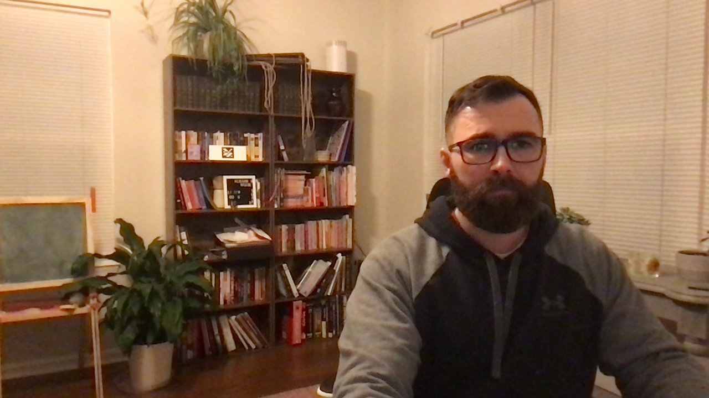

<!-- Improved compatibility of back to top link: See: https://github.com/othneildrew/Best-README-Template/pull/73 -->

<a name="readme-top"></a>

<!-- PROJECT SHIELDS -->

[![Contributors][contributors-shield]][contributors-url]
[![Forks][forks-shield]][forks-url]
[![Stargazers][stars-shield]][stars-url]
[![Issues][issues-shield]][issues-url]
[![MIT License][license-shield]][license-url]
[![LinkedIn][linkedin-shield]][linkedin-url]

<!-- PROJECT LOGO -->
<br />
<div align="center">
  <a href="https://github.com/Kevin-Heleodoro/Augmented-Museum">
    
  </a>

<h3 align="center">Augmented Museum</h3>

  <p align="center">
    Augmented Reality application to display paintings on a surface.
    <br />
    <a href="https://github.com/Kevin-Heleodoro/Augmented-Museum"><strong>Explore the docs »</strong></a>
    <br />
    <br />
    <a href="https://github.com/Kevin-Heleodoro/Augmented-Museum">View Demo</a>
    ·
    <a href="https://github.com/Kevin-Heleodoro/Augmented-Museum/issues">Report Bug</a>
    ·
    <a href="https://github.com/Kevin-Heleodoro/Augmented-Museum/issues">Request Feature</a>
  </p>
</div>

<!-- TABLE OF CONTENTS -->
<details>
  <summary>Table of Contents</summary>
  <ol>
    <li>
      <a href="#about-the-project">About The Project</a>
      <ul>
        <li><a href="#built-with">Built With</a></li>
      </ul>
    </li>
    <li>
      <a href="#getting-started">Getting Started</a>
      <ul>
        <li><a href="#prerequisites">Prerequisites</a></li>
        <li><a href="#installation">Installation</a></li>
      </ul>
    </li>
    <li><a href="#usage">Usage</a></li>
    <li><a href="#roadmap">Roadmap</a></li>
    <li><a href="#contributing">Contributing</a></li>
    <li><a href="#license">License</a></li>
    <li><a href="#contact">Contact</a></li>
    <li><a href="#acknowledgments">Acknowledgments</a></li>
  </ol>
</details>

<!-- ABOUT THE PROJECT -->

## About The Project

<!-- [![Product Name Screen Shot][product-screenshot]](https://example.com) -->

The idea of this project is to give a user the ability to create a virtual museum in whatever physical space they have (home, office, etc.). The goal is to create framed paintings/photos to be "hung" on a wall as one would normally do.

Presentation video and demo can be found [here](https://github.com/Kevin-Heleodoro/Augmented-Museum/blob/main/CS%205330%20Video.mp4)!

IEEE Conference Write up can be found [here](https://github.com/Kevin-Heleodoro/Augmented-Museum/blob/main/Augment_Museum_Heleodoro.pdf)

<p align="right">(<a href="#readme-top">back to top</a>)</p>

### Built With

-   [C++](https://cplusplus.com/)
-   [OpenCV](https://opencv.org/)
-   [CmdParser Library](https://github.com/FlorianRappl/CmdParser)

<p align="right">(<a href="#readme-top">back to top</a>)</p>

<!-- GETTING STARTED -->

## Getting Started

To get a local copy up and running follow these simple example steps. This application was built and tested on a Mac OS using g++ and Make to compile the code.

### Prerequisites

-   [ ] Make
-   [ ] OpenCV

<!-- Give references to install Make and OpenCV -->

### Installation

1. Clone the repo

```sh
git clone https://github.com/Kevin-Heleodoro/Augmented-Museum.git
```

2. Run Make from the root directory

```sh
make
```

<p align="right">(<a href="#readme-top">back to top</a>)</p>

<!-- USAGE EXAMPLES -->

## Usage

1.  To compile the project using the `makefile` simply execute the `make` command with no parameters at the root of the project.
2.  To run the program execute `./bin/main.exe`

```sh
Available parameters:

  -h	--help

   This parameter is optional. The default value is ''.

  -p	--path
   Set path for directory containing images. Defaults to bin/paintings directory which contains a handful of assorted artworks.
   This parameter is optional. The default value is 'bin/paintings'.

  -c	--calibration
   Path to camera calibration file
   This parameter is optional. The default value is 'bin/calibration.xml'.

  -a	--aruco
   If true, creates an ArUco marker and saves it
   This parameter is optional. The default value is '0'.
```

3.

<p align="right">(<a href="#readme-top">back to top</a>)</p>

<!-- ROADMAP -->

## Roadmap

-   [x] ArUco Marker detection

    -   ArUco markers can be detected by the application. Pose estimation calculated and frame axes drawn on the center of the marker.
        

-   [x] Placing image over ArUco Marker

    -   Test image can be placed over ArUco marker. However the image sizing needs to be adjusted. The left border also sticks to the edge of the frame.
        

    -   I was incorrectly calculating new marker corners instead of using the known marker corners that were gathered during detection. Overlay image now covers ArUco marker and rotates/translates along with it.
        

-   [x] I want to paste the overlay image using the first ArUco marker corner while maintaining the original size of the image. The overlay should still rotate and translate with the ArUco marker, it will just be bigger.

    -   First attempt was able to match the first corners but the translation/rotation does not happen as expected. With this attempt I was using the difference between the starting points and the overlay's rows and columns. This did not account for the 3rd dimension translations.
        

    -   Was able to get the image to overlay in a large format relative to the aruco marker and maintaining its original aspect ratio. However, it was not completely stable at certain angles.
        
        

    -   Using a 560x720 frame I was able to overlay the image onto a marker. (Marker located on bookshelf)
        
        

-   [ ] Application stops rendering overlay if the ArUco marker moves too quickly within the frame.

    -   Using `SOLVEPNP_ITERATIVE` which is faster at the expense of accuracy. Provides negligible differences to the eye.
    -   Storing the last known position of the overlay if detector disappears briefly.
        -   This caused a lot of movement in the image and left a transparent ghost of the overlay frozen

-   [x] Allow user to cycle through images.

    -   User can select a directory containing images that will be loaded into the program. Using the `a` and `d` keys will allow the user to cycle through them.

-   [ ] User can display multiple images at a given time on different ArUco markers.

    -   First test of displaying multiple images completed. Need to make the necessary adjustments from previous step to ensure images are the correct size.
        

-   [ ] Clicking on an image will display some metadata in a pop up.
-   [ ] Users can dynamically resize the image in real time.
-   [ ] Users can assign an image to a particular marker.

See the [open issues](https://github.com/Kevin-Heleodoro/Augmented-Museum/issues) for a full list of proposed features (and known issues). -->

<p align="right">(<a href="#readme-top">back to top</a>)</p>

<!-- CONTRIBUTING -->

## Contributing

Contributions are what make the open source community such an amazing place to learn, inspire, and create. Any contributions you make are **greatly appreciated**.

If you have a suggestion that would make this better, please fork the repo and create a pull request. You can also simply open an issue with the tag "enhancement".
Don't forget to give the project a star! Thanks again!

1. Fork the Project
2. Create your Feature Branch (`git checkout -b feature/AmazingFeature`)
3. Commit your Changes (`git commit -m 'Add some AmazingFeature'`)
4. Push to the Branch (`git push origin feature/AmazingFeature`)
5. Open a Pull Request

<p align="right">(<a href="#readme-top">back to top</a>)</p>

<!-- LICENSE -->

## License

Distributed under the MIT License.

<!-- See `LICENSE.txt` for more information. -->

<p align="right">(<a href="#readme-top">back to top</a>)</p>

<!-- CONTACT -->

## Contact

Your Name - [@Golden_Sun_Kev](https://twitter.com/@Golden_Sun_Kev) - kevin.heleodoro@gmail.com

Project Link: [https://github.com/Kevin-Heleodoro/Augmented-Museum](https://github.com/Kevin-Heleodoro/Augmented-Museum)

<p align="right">(<a href="#readme-top">back to top</a>)</p>

<!-- ACKNOWLEDGMENTS -->

## Acknowledgments

-   Salin Boonbrahm et al., "The Use of Marker-Based Augmented Reality in Space Measurement," in _Procedia Manufacturing_, vol. 42, pp. 337-343, 2020, doi: [10.1016/j.promfg.2020.02.081](https://doi.org/10.1016/j.promfg.2020.02.081).

-   Rusnida Romli et al., "Mobile Augmented Reality (AR) Marker-based for Indoor Library Navigation," in _IOP Conference Series: Materials Science and Engineering_, vol. 767, 012062, 2020.

-   Tommaso Tocci et al., "ArUco marker-based displacement measurement technique: uncertainty analysis," in _Engineering Research Express_, vol. 3, 035032, 2021.

-   OpenCV Contributors, "Camera Calibration and 3D Reconstruction," 2024, [OpenCV documentation](https://docs.opencv.org/4.x/d9/d0c/group__calib3d.html).

-   OpenCV Contributors, "ArucoDetector Class Reference," 2024, [OpenCV documentation](https://docs.opencv.org/4.x/d2/d1a/classcv_1_1aruco_1_1ArucoDetector.html).

-   Ikarus777, "Best Artworks of All Time," 2024, [Kaggle dataset](https://www.kaggle.com/datasets/ikarus777/best-artworks-of-all-time?resource=download-directory&select=resized).

-   Rahul Kedia, "Augmented Reality Television with ArUco Markers: OpenCV, Python, C++," 2021, [Medium article](https://kediarahul.medium.com/augmented-reality-television-with-aruco-markers-opencv-python-c-c81823fbff54).

<p align="right">(<a href="#readme-top">back to top</a>)</p>

<!-- MARKDOWN LINKS & IMAGES -->
<!-- https://www.markdownguide.org/basic-syntax/#reference-style-links -->

[contributors-shield]: https://img.shields.io/github/contributors/Kevin-Heleodoro/Augmented-Museum.svg?style=for-the-badge
[contributors-url]: https://github.com/Kevin-Heleodoro/Augmented-Museum/graphs/contributors
[forks-shield]: https://img.shields.io/github/forks/Kevin-Heleodoro/Augmented-Museum.svg?style=for-the-badge
[forks-url]: https://github.com/Kevin-Heleodoro/Augmented-Museum/network/members
[stars-shield]: https://img.shields.io/github/stars/Kevin-Heleodoro/Augmented-Museum.svg?style=for-the-badge
[stars-url]: https://github.com/Kevin-Heleodoro/Augmented-Museum/stargazers
[issues-shield]: https://img.shields.io/github/issues/Kevin-Heleodoro/Augmented-Museum.svg?style=for-the-badge
[issues-url]: https://github.com/Kevin-Heleodoro/Augmented-Museum/issues
[license-shield]: https://img.shields.io/github/license/Kevin-Heleodoro/Augmented-Museum.svg?style=for-the-badge
[license-url]: https://github.com/Kevin-Heleodoro/Augmented-Museum/blob/master/LICENSE.txt
[linkedin-shield]: https://img.shields.io/badge/-LinkedIn-black.svg?style=for-the-badge&logo=linkedin&colorB=555
[linkedin-url]: https://linkedin.com/in/Kevin-Heleodoro
